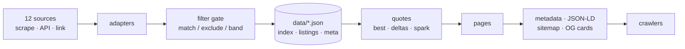
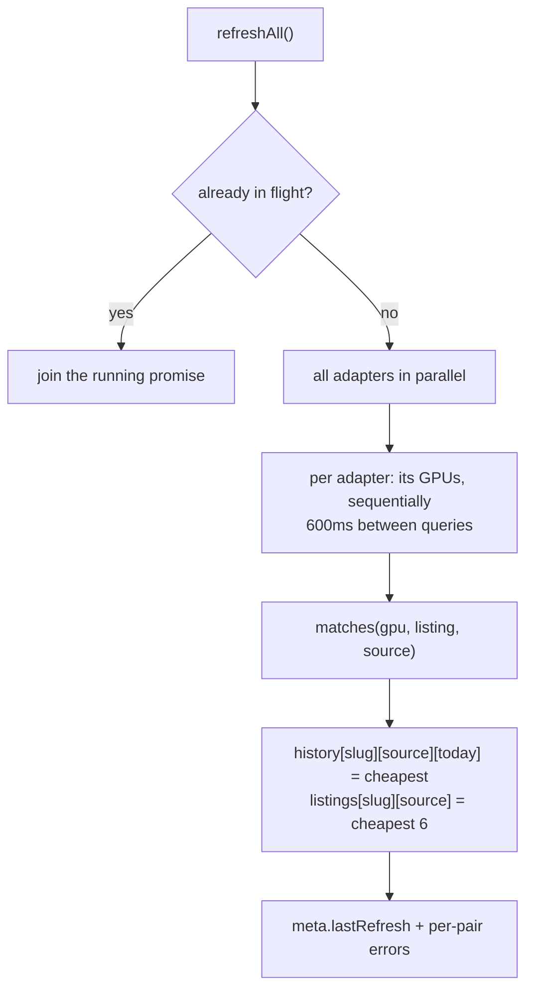

# How the aggregator and indexing work

VRAMWATCH runs two pipelines in opposite directions.

- **The aggregator** pulls prices *in*: search pages and APIs at twelve sources
  become filtered listings, a daily price index, and the quotes the UI
  renders.
- **Indexing** pushes the result *out*: every page emits canonical metadata,
  structured data and social cards so a crawler can read the board as data
  rather than as a screenshot.

They meet in the middle at `data/*.json` — the store is the aggregator's
output and the indexer's input.



---

# Part 1 — The aggregator

## 1. The parts catalog

`lib/gpus.ts` is the spine. Each of the 32 tracked parts — 25 bare cards plus
7 whole GPU systems — declares not just what it *is* but how to recognize it
in a stranger's search results:

| Field | Role |
| --- | --- |
| `query` | The default string sent to a source's search |
| `modelQuery` | The bare model token ("H100", "MI300X") for sources that need it |
| `queries` | Per-source overrides, when one source needs different phrasing |
| `match` | Case-insensitive regex the listing title **must** match |
| `exclude` | Regex that disqualifies a listing (wrong SKU, parts, bundles) |
| `priceMin` / `priceMax` | Sanity band — anything outside is not this card |
| `usedOk` | EOL parts (RTX 4090, V100) may quote used prices at retailers |
| `sources` | Which source ids carry this part, in display order |

Two shared exclude fragments do most of the work. `JUNK` throws out
waterblocks, backplates, brackets, cables, risers, shrouds, laptops and
eGPU enclosures. `DC_JUNK` extends it for datacenter searches, where a query
for "H100" otherwise returns whole 4U SuperServers, baseboards, heatsinks
and 8-GPU trays instead of a bare card.

The price band is the backstop the regexes can't be: an RTX 5090 listed at
$180 is a cable, and one at $12,000 is a scalp or a server. Both are
dropped without needing a rule that anticipates them.

## 2. The source registry

`lib/sources.ts` lists nine sources, each in one of three modes:

| Mode | Behaviour | Sources |
| --- | --- | --- |
| `scrape` | Fetched live server-side (verified to serve plain HTML or JSON) | Newegg, Central Computer, Wiredzone, PC Server & Parts, TechMikeNY, Server Part Deals, Supermicro Store |
| `api` | Official API, activates only when env keys exist | eBay, Best Buy |
| `link` | Bot-blocks server requests — gets a deep search link, no price | Micro Center, B&H Photo, Amazon |

Micro Center is the notable link-only entry: it returns HTTP 403 to a server
for *every* path, `robots.txt` included. The only ways past that are spoofing
a search-engine user agent or proxying through residential IPs, so it stays
link-only rather than quoting a price we can't honestly fetch.

`kind` distinguishes retailer / reseller / marketplace / `oem`. The Supermicro
store is the only `oem` — the manufacturer selling direct, and the reason the
board can price whole GPU systems at all.

`usedSource: true` marks a source whose inventory is used or refurbished by
nature (eBay, PC Server & Parts), which changes how the filter gate treats
condition. `color` is a fixed categorical chart slot — a source keeps the
same color on every chart it appears on.

## 3. Adapters

One adapter per fetchable source, all satisfying the same three-line
contract from `lib/types.ts`:

```ts
interface SourceAdapter {
  id: string;
  fetchListings(query: string): Promise<Listing[]>;   // { title, price, url }[]
}
```

That is the entire seam. An adapter knows one site's markup and nothing
about GPUs, filtering, history or the UI.

| Adapter | Storefront | How it extracts a listing |
| --- | --- | --- |
| `newegg` | Newegg | Splits on `item-cell`, reads the `item-title` anchor and the `price-current` `<strong>`/`<sup>` pair |
| `central` | Magento | Splits on `product-item-name`, reads the titled `product-item-link` and the `data-price-amount` marked `finalPrice` |
| `wiredzone` | Odoo | Walks `/shop/product/…` anchors, then reads the schema.org `itemprop=price` span in the following 1200 chars |
| `pcsp` | BigCommerce | Each card title anchor carries `aria-label="TITLE, $PRICE"` — parsed as one string |
| `ebay` | Browse API | OAuth client-credentials token (cached until 60s before expiry), 50 fixed-price US items sorted by price |
| `bestbuy` | Products API | Query words become ANDed `search=` clauses; keeps `onlineAvailability` items with a real `salePrice` |
| `shopify` | Shopify | Reads `/search/suggest.json` — structured product JSON with a real `available` flag, rather than theme markup that changes on a whim. One factory backs TechMikeNY and Server Part Deals; any Shopify reseller is a one-line addition |
| `supermicro` | Magento | No usable search endpoint, so it walks the GPU category and returns the whole catalog, cached 5 minutes so a sweep costs one fetch rather than one per system |

Scrape adapters share `lib/adapters/http.ts`: browser-shaped headers, a
20-second timeout, one retry after 1200ms, and `cache: "no-store"`.

### Query shape is per source, and it was measured

The single biggest accuracy lever. Search engines disagree violently about
what a good query looks like, so `Source.searchStyle` records what each one
actually wants:

| Style | Sends | Because |
| --- | --- | --- |
| `full` (default) | `"NVIDIA H100 80GB PCIe"` | Newegg and Magento rank the full product name well |
| `model` | `"H100"` | Odoo narrows to nothing on a long string — Wiredzone returned 2 products for the full name and 20 for the bare token. Shopify's suggest endpoint ORs extra words into noise |
| `vendorModel` | `"NVIDIA Tesla V100"` | BigCommerce returns **zero** rows for a bare `"V100"` but 50 for the vendor-qualified form |

A part that still needs different phrasing at one source sets `queries` for it.

`activeAdapters()` in `lib/adapters/index.ts` decides who actually runs.
The four scrapers are always in; eBay and Best Buy join only when their
keys are present. Without keys they degrade to link-only rather than
erroring — that is why the source count on the board changes when you add
API keys.

## 4. The sweep

`refreshAll()` in `lib/refresh.ts` is one full pass.



The concurrency shape is deliberate: **sources run in parallel, queries
within a source run sequentially** with a 600ms gap. Up to six sites are hit
at once — the four scrapers, plus eBay and Best Buy when their keys are set;
link-only sources never make a request. But no single site sees a burst: one
request every 600ms is politeness, not throughput.

`inFlight` collapses concurrent triggers into a single pass. Ten simultaneous
requests to `/api/refresh` produce one sweep and ten copies of its result.

### The filter gate

Every listing passes `matches()` before it counts:

1. **Stock.** A listing the source marks unavailable is dropped outright — a
   price you cannot pay is not a price. Newegg's "Auto Notify" cells carry
   full prices and used to count as quotes.
2. Title matches `gpu.match` (case-insensitive).
3. Title does **not** match `gpu.exclude` — which now also throws out
   multi-unit listings (`lot of 4`, `2-pack`, `qty 3`) that quote the lot
   price rather than the card price.
4. Condition is allowed. Used/refurb/open-box/renewed titles are rejected
   *unless* the part is `usedOk`, the source is `usedSource`, or the source
   is a marketplace. This is what keeps a refurb A100 out of a
   new-condition retail series.
5. Price falls inside `[priceMin, priceMax]`.

Survivors are sorted ascending, then `pickLow()` chooses the day's price. It
does **not** blindly take the cheapest: once there are at least four matches,
a listing priced below 40% of the matched set's median is treated as bait or a
mispriced SKU and skipped. The cheapest six survivors are kept as the "where
to buy" cards, led by the listing the price actually came from.

### The price index

```
history[gpu.slug][sourceId][YYYY-MM-DD] = { lo, hi, n, at }
```

Each sweep **accumulates into** the day rather than overwriting it:

| Field | Meaning |
| --- | --- |
| `lo` | Lowest price seen that day — this is what the charts plot |
| `hi` | Highest price seen that day, giving the intraday range |
| `n` | How many sweeps contributed an observation |
| `at` | Timestamp of the most recent observation |

That makes `lo` a true daily low across every sweep, instead of whatever the
last sweep of the day happened to catch — which is what the old bare-number
format recorded.

Older files still load: `readHistory()` widens a stored `5` into
`{lo: 5, hi: 5, n: 1, at: <midnight>}` on read, so a store written by any
earlier version keeps working and keeps charting.

### Failures

Errors are caught per `(adapter, gpu)` pair and recorded in
`meta.errors` under the key `sourceId:gpu-slug`. A source that goes down or
changes its markup loses its own series and nothing else — the other eight
still write their snapshot, and the sweep still completes.

## 5. The store

`lib/store.ts` is process-local JSON, and the only module that touches disk.

| File | Shape | Meaning |
| --- | --- | --- |
| `history.json` | `slug → sourceId → ISO day → DayStat` | The accruing price index behind every chart |
| `listings.json` | `slug → sourceId → Listing[]` | Cheapest 6 per source from the *last* sweep, powering buy links |
| `meta.json` | `{ lastRefresh, errors }` | Freshness stamp and per-pair failures |

History accumulates and is never pruned; listings are replaced wholesale
each sweep. Swapping to SQLite or Postgres means reimplementing this one
module — everything downstream consumes the same shapes.

## 6. Turning snapshots into quotes

`lib/quotes.ts` derives everything the UI shows. Per GPU:

- **`series`** — one point list per source, sorted by date, with sources
  that have no points dropped entirely.
- **`spark`** — the cross-source cheapest price per day, last 30 days.
- **`best` / `bestSourceId`** — the lowest current price, counting only
  sources whose latest point is from the same day as the newest data. A
  source that stopped reporting three days ago cannot win the headline
  price with a stale number.
- **`spreadHigh` / `observations`** — the highest price seen today across
  sources, and how many observations back the quote. Together they say how
  much the cheapest listing is worth chasing, and how much evidence sits
  behind it.
- **`delta24h` / `delta7d` / `delta30d`** — change against the closest
  snapshot *at least* N days old, computed on the cross-source best. Null
  when history isn't deep enough, which is why a fresh install shows no
  deltas for the first day.

## 7. Staying fresh without cron

There is no scheduler. Traffic drives refresh:

1. `LiveStatus` (on every page) polls `/api/tick` every 10 seconds.
2. `/api/tick` calls `ensureFresh()`, which starts a background sweep if
   `lastRefresh` is older than `SWEEP_INTERVAL_MS` (default 10 minutes,
   floored at 60s), then returns `{ lastRefresh, refreshing }` immediately.
   It never blocks on the sweep.
3. When the client sees a `lastRefresh` it hasn't seen, it calls
   `router.refresh()` — the server components re-render with new prices and
   the page updates itself.

Two escape hatches exist: `POST /api/refresh` (also `GET`) forces a sweep
and waits for the result, and `pnpm refresh` runs one pass from the CLI for
warming data ahead of a deploy or driving a real cron.

Because the store is process-local, **run a single instance** — or replace
`lib/store.ts` with a shared database before scaling out.

## 8. Extending it

**Add a part:** append to `GPUS` in `lib/gpus.ts` with a `query`, a `match`
regex, an `exclude` (start from `JUNK` or `DC_JUNK`), a price band, and the
source list for its segment. Nothing else changes — the sweep, the board,
the sitemap and the OG cards all read from that array.

**Add a source:** write an adapter returning `{title, price, url}[]`,
register it in `lib/adapters/index.ts` and `lib/sources.ts` with a `homepage`,
a `note` (both surface on `/sources`), a `searchStyle` and a chart color, then
add its id to the parts that carry it. If it runs on Shopify, skip the adapter
entirely — `shopify(id, host)` is the whole implementation.

**Then run the palette check.** Chart series must stay separable for
colour-blind readers:

```sh
pnpm palette
```

It simulates protanopia, deuteranopia and tritanopia and reports the minimum
CIE ΔE between any two series that share a chart. Keep it at 20 or above. This
caught a real, long-standing collision: eBay's blue against Wiredzone's violet
sat at ΔE 2.5 under protanopia — indistinguishable. The current palette is 25.1.

### Diagnostics

Four scripts exist for the questions that actually come up when a price goes
missing:

```sh
pnpm probe <source> <query>   # what does this adapter return right now?
pnpm why <gpu-slug> <source>  # per listing, which filter rejected it and why
pnpm coverage [source ...]    # matched counts per (part, source), query variants
pnpm palette                  # CVD separation of the chart palette
```

`pnpm why` is usually the fastest way to tell a broken adapter from a source
that simply doesn't stock the part — a distinction that looks identical from
the outside, since both show up as an empty chart.

---

# Part 2 — How indexing works

Indexing means two different things here, and both are generated — nothing
about the crawler surface is hand-maintained, so adding a GPU adds its page,
its sitemap entry, its structured data and its social card in one edit.

## 1. One canonical origin

`lib/site.ts` resolves the origin once:

```
NEXT_PUBLIC_SITE_URL  →  VERCEL_PROJECT_PRODUCTION_URL  →  https://vram.swarms.world
```

Trailing slashes are stripped, and every absolute URL in the app — canonical
tags, sitemap entries, OG image URLs, JSON-LD `@id`s — is built from it via
`absoluteUrl()` or Next's `metadataBase`. A wrong value here silently
poisons every canonical at once, which is exactly why there is only one.

The same file holds the brand, the boilerplate descriptions and the
site-wide keyword set, so title/description copy can't drift between the
layout, the OG card and the structured data.

## 2. What each route emits

| Route | Rendering | Emits |
| --- | --- | --- |
| `/` | dynamic (SSR) | Title, description, canonical, OG/Twitter, `CollectionPage` + `ItemList` + `FAQPage` |
| `/gpu/[slug]` | dynamic (SSR) | Live-price title/description, canonical, OG/Twitter, `Product` + `AggregateOffer` + `BreadcrumbList` |
| `/robots.txt` | static | Allow all, disallow `/api/`, sitemap + host |
| `/sources` | dynamic (SSR) | Every source, what it covers, why link-only ones are; `CollectionPage` + `ItemList` + `BreadcrumbList` |
| `/sitemap.xml` | ISR, 1h | Home, `/sources`, and all 32 parts, `lastmod` from the real last sweep |
| `/manifest.webmanifest` | static | PWA manifest, green theme color |
| `/icon.svg` | static | The green box favicon |
| `/apple-icon` | static | Same box, 180×180 PNG |
| `/opengraph-image` | static | 1200×630 brand card |
| `/gpu/[slug]/opengraph-image` | ISR, 10m | 1200×630 card with the part's live price and 24h move |

Pages are `force-dynamic` because prices are live. Next streams metadata for
dynamic routes; the title, canonical and OG tags are present in the served
HTML, and Next blocks the stream for HTML-limited bots so they see a
complete `<head>`.

## 3. Metadata layering

The root layout sets the defaults: `metadataBase`, the `%s | VRAMWATCH`
title template, robots (including a `googlebot` rule with
`max-image-preview:large` and `max-snippet:-1`), icons, manifest, and the
site-wide OG/Twitter block.

Pages override from there. One sharp edge worth knowing: **Next replaces the
`openGraph` object across segments rather than deep-merging it.** A page that
sets `openGraph: { title }` drops the layout's `siteName` and `locale`. Both
`app/page.tsx` and `app/gpu/[slug]/page.tsx` therefore restate `siteName` and
`locale` in their own `openGraph` blocks. If you add a page with custom OG
tags, restate them there too.

The GPU page's title and description are computed by one `seoCopy()` helper
that both `generateMetadata` and the page body call, so the SERP snippet, the
JSON-LD `description` and the on-page summary always agree:

```
GeForce RTX 5090 Price — $4,400 (Live, Central Computer) | VRAMWATCH
```

The price in the title is the live quote, so the snippet stays current
instead of going stale the week after it's crawled.

## 4. Structured data

`lib/seo.ts` builds every JSON-LD node; `components/JsonLd.tsx` serializes it
and escapes `<` so a hostile listing title can't break out of the script tag.
Nodes ship in a single `@graph` per document and cross-reference by `@id`.

**Site-wide** (root layout): `Organization` and `WebSite`, both with stable
`@id`s that other nodes point at.

**Home:** `CollectionPage`, an `ItemList` of all 32 parts with their current
prices, and a `FAQPage`.

**Each GPU page:** a `Product` carrying `brand`, `sku`, `category`, and
`additionalProperty` entries for VRAM, architecture, segment and MSRP, plus
an `AggregateOffer` assembled from that part's **real** listings —
`lowPrice`, `highPrice`, `offerCount`, and up to three per-seller `Offer`s
each with its URL, seller name, and `itemCondition` derived from whether the
source is used-by-nature. A `BreadcrumbList` sits alongside it.

The FAQ is the one place visible copy and markup could diverge, so they
can't: `app/page.tsx` renders both the `<dl>` and the `FAQPage` markup from
the same `FAQ` array. Google requires the two to match.

## 5. The crawl path

```
sitemap.xml ──► /  ──► /gpu/<slug>  ──► related parts in the same segment
                 │                        (up to 6 internal links per page)
                 └─ ticker tape + board links to all 32 parts
```

Every part is one hop from the home page, and each GPU page links to up to
six siblings in its segment, so no page is orphaned and crawl depth never
exceeds two. Outbound buy links carry `rel="nofollow sponsored"` — they are
commercial destinations, and link equity stays on the board.

## 6. Social cards

Both OG images are rendered by `next/og` (satori) at request time, not
checked in as assets. The per-GPU card reads the live quote and shows
ticker, specs, best price, 24h move and the winning source; it revalidates
every 10 minutes so a shared link shows a current price.

One constraint to remember when editing them: satori requires any element
with more than one child to declare `display: flex` explicitly, and **each
JSX interpolation counts as a child**. `{a} · {b}` is three children and will
fail the build; ``{`${a} · ${b}`}`` is one.

## 7. Verifying it

With the app running:

```sh
curl -s localhost:3000/robots.txt
curl -s localhost:3000/sitemap.xml | head -20

# head tags on a part page
curl -s localhost:3000/gpu/rtx-5090 \
  | grep -oE '<title>[^<]*|<link rel="canonical"[^>]*|<meta property="og:[^>]*'

# structured data, parsed
curl -s localhost:3000/gpu/rtx-5090 \
  | python3 -c 'import sys,re,json; [print(json.dumps(n,indent=1)) for b in re.findall(r"ld\+json\">(.*?)</script>", sys.stdin.read(), re.S) for n in json.loads(b.replace("\\u003c","<"))["@graph"]]'

# the generated cards
curl -s -o card.png localhost:3000/gpu/rtx-5090/opengraph-image && file card.png
```

Externally: Google Rich Results Test for the `Product` and `FAQPage` nodes,
Search Console for coverage against `sitemap.xml`, and any OG debugger for
the cards.

## 8. Numbers worth knowing

| Constant | Value | Where |
| --- | --- | --- |
| Delay between queries to one source | 600ms | `PER_QUERY_DELAY_MS` |
| Listings kept per (GPU, source) | 6 | `KEPT_LISTINGS` |
| Sweep interval | 10 min (floor 60s) | `SWEEP_INTERVAL_MS` |
| UI poll interval | 10s | `POLL_MS` in `LiveStatus` |
| Scrape timeout / retries | 20s / 1 retry after 1.2s | `lib/adapters/http.ts` |
| API page size | 50 items | eBay, Best Buy |
| Sparkline window | 30 days | `lib/quotes.ts` |
| Outlier floor | 40% of matched median (min 4 listings) | `OUTLIER_FLOOR` |
| Supermicro catalog cache | 5 min | `lib/adapters/supermicro.ts` |
| Minimum chart colour separation | ΔE 20 (currently 25.1) | `pnpm palette` |
| Sitemap revalidate | 1 hour | `app/sitemap.ts` |
| Per-GPU OG card revalidate | 10 min | `app/gpu/[slug]/opengraph-image.tsx` |
